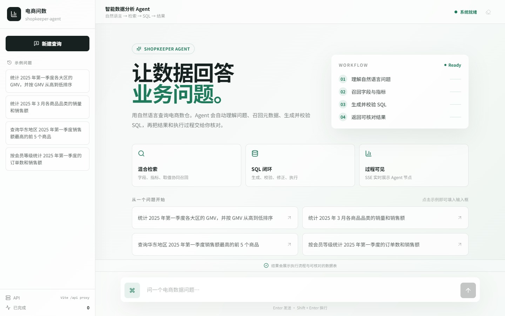
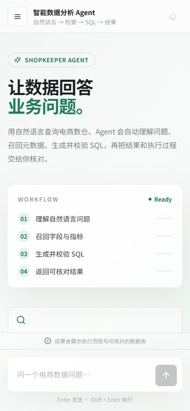

<div align="center">
  <h1>电商问数智能数据分析 Agent</h1>
  <h3>shopkeeper-agent</h3>
  <p>
    <em>
      用自然语言查询电商数仓：混合检索 + LangGraph 多阶段推理 + SQL 生成校验执行 + 前端流式展示
    </em>
  </p>
</div>

<div align="center">


</div>

<p align="center">
  
</p>

## 项目简介

业务同学通常不会写 SQL，分析同学也很难随时记住全部表结构、字段含义、指标口径和字段取值。如果只是把自然语言问题直接丢给大模型，很容易出现：

- 表选错
- 字段选错
- 指标理解错
- SQL 幻觉

`shopkeeper-agent` 面向电商数仓问数场景，完整打通这条链路：

1. 用户用自然语言提问
2. 系统自动召回相关字段、指标和字段取值
3. LangGraph 编排多阶段推理
4. 生成 SQL 并做校验 / 修正
5. 执行查询并返回结果
6. 前端通过 SSE 实时展示节点进度与结果表格

它不是“调一次大模型接口”的 Demo，而是一个可本地运行、可前后端联调、可继续二次开发的完整 AI Agent 工程。

## 效果展示

### 1. 首页：自然语言问数入口

新版首页把自然语言入口、Agent 工作流、核心能力和示例问题组织在同一视图中。桌面端提供快捷查询侧栏和系统状态栏，访客可以快速理解项目解决的问题与执行过程。

<p align="center">
  
</p>

### 2. 移动端：完整的响应式问数体验

移动端使用抽屉导航和稳定的底部输入区，支持示例问题、发起查询、停止任务和查看结果，不会出现横向溢出。

<p align="center">
  
</p>

### 3. 查询结果：过程可解释 + 结果可核对

结果页会展示 LangGraph 执行流程、生成 / 校验 / 修正后的 SQL，以及最终查询结果表。

<p align="center">
  
</p>

### 4. 系统架构

前端通过 FastAPI 与 SSE 连接后端；后端由 LangGraph 问数智能体驱动，协同 Jieba、MySQL、Qdrant、Elasticsearch 和 LLM，完成召回、SQL 生成、校验、执行与结果返回。

<p align="center">
  
</p>

## 项目亮点

- **检索 + 推理 + 生成，而不是模型直出 SQL**  
  先围绕问题召回相关字段、指标和值域，再组织上下文生成 SQL，整体链路更稳、更可控。

- **面向企业问数场景的混合检索**
  - `Qdrant`：字段和指标的语义召回
  - `Elasticsearch`：字段取值的全文检索
  - `MySQL`：权威结构化元数据与示例数仓

- **字段 / 指标 / 取值三类信息协同召回**  
  比单纯做表级或字段级检索更贴近真实分析流程。

- **从检索到执行的完整可运行链路**  
  真实生成 SQL、校验修正、执行查询，并通过 SSE 把过程流式返回前端。

- **工程结构清晰，便于维护和扩展**  
  基于 `FastAPI + LangGraph + Repository + Client Manager` 分层组织配置、客户端、仓储层、服务层与智能体流程，数据层、检索层、智能体层、服务层和前端层职责清晰，可继续扩展权限控制、SQL 审核、图表可视化等能力。

## 适用场景

- 电商 / 零售数仓的自助问数与自然语言数据分析
- 需要在同一业务场景中协同结构化元数据、向量检索和全文检索的问数系统
- 对模型直出 SQL 的准确性有要求，需要召回、校验、修正闭环的分析型应用
- 作为混合检索 + LangGraph 多阶段推理的工程参考实现

## 系统主线

项目围绕两条主线展开：

| 主线 | 做什么 | 涉及模块 |
| --- | --- | --- |
| 元数据知识库构建 | 抽取示例数仓中的表、字段、指标和字段取值，写入结构化库、向量库和全文索引 | `MySQL` / `Qdrant` / `Elasticsearch` / `TEI` |
| 自然语言问数 | 基于用户问题完成召回、上下文整理、SQL 生成校验执行，并把过程流式返回前端 | `LangGraph` / `FastAPI` / `SSE` / `React` |

### 问数流程（简版）

```text
用户问题
  -> 关键词扩展 / 分词
  -> 字段召回（Qdrant）
  -> 指标召回（Qdrant）
  -> 取值召回（Elasticsearch）
  -> 表 / 指标过滤与上下文合并
  -> SQL 生成
  -> SQL 校验
  -> SQL 修正（必要时）
  -> 执行 SQL
  -> SSE 流式返回进度与结果
```

## 技术栈

| 模块 | 技术 | 作用 |
| --- | --- | --- |
| 示例数仓 | `MySQL` | 模拟事实表、维度表和分析型查询环境 |
| 元数据库 | `MySQL` / `SQLAlchemy` | 保存表、字段、指标、字段指标关系等结构化元数据 |
| 向量检索 | `Qdrant` | 保存字段和指标向量，支持语义召回 |
| 全文检索 | `Elasticsearch` | 保存字段真实取值，支持关键词和值域检索 |
| Embedding | `TEI` / `BAAI/bge-large-zh-v1.5` | 将字段、指标、问题等文本转成向量 |
| 智能体编排 | `LangGraph` | 组织多阶段问数工作流 |
| 模型接入 | `LangChain` | 封装 LLM 调用 |
| 后端接口 | `FastAPI` | 提供问数 API、依赖注入和生命周期管理 |
| 流式协议 | `SSE` | 实时返回节点进度、查询结果和错误消息 |
| 前端 | `React 19` / `TypeScript` / `Vite 6` / `Tailwind CSS` | 提供响应式问数工作台、移动抽屉、运行状态和结果展示 |
| 日志追踪 | `ContextVar` / `loguru` | 为并发请求注入 request_id，便于排查链路 |
| 依赖管理 | `uv` / `pnpm` | 管理 Python 后端和前端依赖 |

## 项目结构

```text
shopkeeper-agent/
├── app/
│   ├── agent/            # LangGraph 图、状态、上下文和各类节点
│   ├── api/              # FastAPI 路由、依赖注入、生命周期和请求结构
│   ├── clients/          # MySQL、Qdrant、Elasticsearch、Embedding 客户端管理
│   ├── conf/             # 配置 dataclass 与配置加载工具
│   ├── core/             # 日志、request_id 上下文等通用能力
│   ├── entities/         # 更贴近业务语义的数据对象
│   ├── models/           # SQLAlchemy ORM 模型
│   ├── prompt/           # Prompt 加载工具
│   ├── repositories/     # MySQL、Qdrant、Elasticsearch 数据访问层
│   ├── scripts/          # 元数据知识库构建脚本
│   └── services/         # 元数据构建服务和问数查询服务
├── conf/                 # app_config.yaml、meta_config.yaml
├── docker/               # Docker Compose、MySQL 初始化 SQL、ES 插件、Embedding 挂载目录
├── docs/images/          # 架构图与产品截图
├── frontend/             # React + Vite + Tailwind CSS 前端项目
├── prompts/              # SQL 生成、修正、过滤等 Prompt 模板
├── main.py               # FastAPI 应用入口
└── pyproject.toml        # Python 项目依赖与工具配置
```

## 快速开始

### 1. 环境准备

- Python `>= 3.14`
- `uv`
- Docker 与 Docker Compose
- Node.js 与 `pnpm`

### 2. 获取代码

获取代码：

```bash
git clone https://github.com/qiqiqi-max/shopkeeper-agent.git
cd shopkeeper-agent
```

### 3. 安装后端依赖

```bash
uv sync
```

### 4. 配置大模型 API

```bash
cp .env.example .env
```

编辑 `.env`：

```bash
LLM_API_KEY=your_real_api_key
LLM_BASE_URL=https://api.siliconflow.cn/v1
```

对应配置位于 [conf/app_config.yaml](conf/app_config.yaml)：

```yaml
llm:
  model_name: deepseek-v4-flash
  api_key: ${oc.env:LLM_API_KEY}
  base_url: ${oc.env:LLM_BASE_URL}
```

如需使用其他兼容 OpenAI API 的模型平台，修改 `model_name` 和 `LLM_BASE_URL` 即可。

### 5. 准备 Embedding 模型

项目通过 `TEI` 加载 `BAAI/bge-large-zh-v1.5`。模型文件体积较大，仓库中不会提交权重，需要先下载到 Docker 挂载目录：

```bash
uv run hf download BAAI/bge-large-zh-v1.5 --local-dir docker/embedding/bge-large-zh-v1.5
```

如果手动下载，请解压到：

```text
docker/embedding/bge-large-zh-v1.5
```

### 6. 启动 Docker 基础服务

```bash
docker compose -f docker/docker-compose.yaml up -d
```

默认端口：

| 服务 | 端口 |
| --- | --- |
| MySQL | `13306` |
| Elasticsearch | `9200` |
| Kibana | `5601` |
| Qdrant | `6333` |
| Embedding | `8081` |

> `docker/mysql/meta.sql` 和 `docker/mysql/dw.sql` 会在 MySQL 容器首次启动时自动初始化元数据库和示例数仓。

### 7. 构建元数据知识库

```bash
uv run python -m app.scripts.build_meta_knowledge -c conf/meta_config.yaml
```

这一步会：

- 把表字段元数据写入 MySQL
- 把字段和指标向量写入 Qdrant
- 把字段真实取值写入 Elasticsearch

### 8. 启动后端

```bash
uv run fastapi dev main.py
```

或者：

```bash
uv run uvicorn main:app --host 127.0.0.1 --port 8000 --reload
```

后端接口：

```text
POST http://127.0.0.1:8000/api/query
```

请求示例：

```json
{
  "query": "统计华北地区的销售总额"
}
```

SSE 消息类型：

| 类型 | 含义 |
| --- | --- |
| `progress` | 节点执行进度 |
| `result` | 最终查询结果 |
| `error` | 全局异常消息 |

### 9. 启动前端

```bash
cd frontend
pnpm install
pnpm dev
```

浏览器打开：

```text
http://localhost:5173
```

前端默认通过 Vite 代理把 `/api` 转发到 `http://127.0.0.1:8000`。如需修改：

```bash
cd frontend
cp .env.example .env
```

```bash
VITE_DEV_PROXY_TARGET=http://127.0.0.1:8000
```

## 示例问题

你可以直接在前端试这些问法：

- 统计华北地区的销售总额
- 查询最近一个月销量最高的商品
- 对比不同渠道的订单转化情况
- 看看各区域客户数和订单数分别是多少

## 本地开发建议

1. 先保证 Docker 五个基础服务全部健康
2. 再跑元数据知识库构建脚本
3. 最后启动后端和前端
4. 如果 SQL 结果异常，优先检查：
   - Embedding 服务是否 Ready
   - Qdrant / ES 是否写入成功
   - LLM API Key 与 base_url 是否有效

## 常见问题

### 1. Embedding 启动很慢？

正常现象。首次加载 `bge-large-zh-v1.5` 需要预热，等 Docker 日志出现 `Ready` 后再构建知识库或提问。

### 2. MySQL 端口为什么是 13306？

为了减少和本机已有 MySQL 冲突，项目默认把容器端口映射为 `13306:3306`，应用配置也对应 `13306`。

### 3. 为什么仓库里没有 embedding 模型？

模型体积太大，不适合放进 Git。按 README 下载到 `docker/embedding/bge-large-zh-v1.5` 即可。

### 4. 前端能打开，但提问失败？

按这个顺序排查：

1. 后端 `http://127.0.0.1:8000/docs` 是否可访问
2. `.env` 中 `LLM_API_KEY` / `LLM_BASE_URL` 是否正确
3. 是否已成功执行 `build_meta_knowledge`
4. Qdrant / ES / Embedding 是否都在运行

## 后续可扩展方向

- SQL 审核与权限控制
- 结果图表可视化
- 多轮对话与上下文记忆
- 指标口径版本管理
- 更细粒度的召回评估与链路追踪

## License

本项目采用 [Apache-2.0](./LICENSE) 开源协议。
