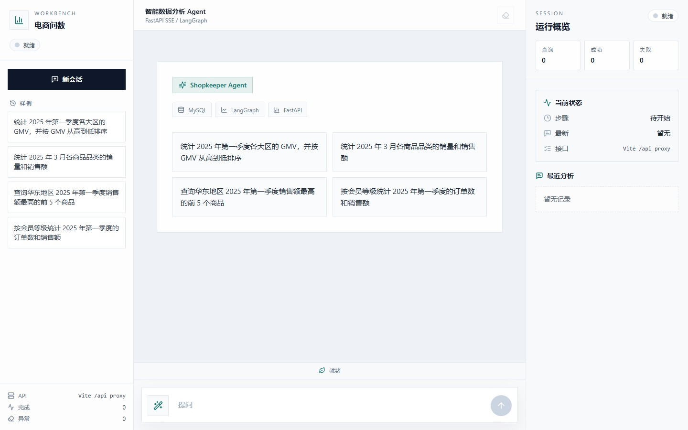
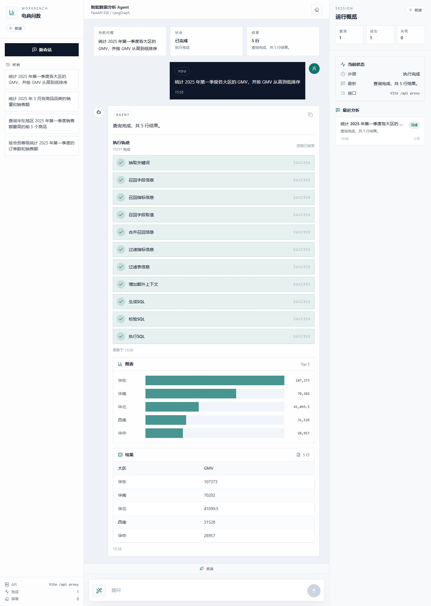

<div align="center">
  <h1 style="margin-top: 15px;">电商问数智能数据分析 Agent</h1>
  <h4><b>shopkeeper-agent</b></h4>
  <p><em>面向电商数仓问数场景的智能数据分析工作台，支持自然语言提问、混合检索、LangGraph 流程编排、SQL 生成校验和 SSE 流式返回</em></p>
</div>

<div align="center">


</div>





## 项目简介

这个项目解决的是一个很具体的问题: 业务同学想问数，但不想自己写 SQL，也不想去记表、字段、指标和口径。

现在这版已经把召回、生成、校验、执行和展示串成了一条完整链路:

- 用户输入自然语言问题
- 系统召回相关字段、指标和字段取值
- LangGraph 组织多阶段问数流程
- 生成 SQL、校验 SQL、执行 SQL
- 结果通过 SSE 流式返回到前端

前端也改成了三栏工作台，不再只是单一聊天框:

- 左侧是样例问题、新会话和接口状态
- 中间是对话区、当前问题、执行状态和结果摘要
- 右侧是运行概览、最近分析记录和历史结果打开入口

## 现在的前端

这版界面重点做了三件事:

1. 把问数流程收进一个三栏工作台，信息更集中。
2. 保留流式反馈，让每一步执行状态都看得见。
3. 查询历史写入 MySQL，刷新页面后仍然能打开最近结果。
4. 表格结果会自动识别维度和数值列，补充轻量柱状图。

移动端会自动收敛成单栏布局，桌面端保持三栏。

## 核心能力

- 混合检索: 在线模式下 `Qdrant` 负责字段和指标语义召回，`Elasticsearch` 负责字段取值检索，`MySQL` 保存结构化元数据。
- 流程编排: `LangGraph` 负责把召回、过滤、生成、校验和执行串起来。
- 实时返回: 后端通过 `SSE` 推送节点进度、结果和错误信息。
- 结果展示: 前端同时提供结果表格和轻量柱状图，便于快速读数。
- 历史追踪: 查询记录持久化到 MySQL，右侧面板可查看最近分析。
- 历史管理: 支持打开历史结果和删除单条查询记录，运行中的任务不会被误删。
- 数据落地: 元数据库和教学数仓都接到本地 MySQL，Navicat 里可以直接看 `meta` 和 `dw` 两个库。
- 运行模式: 默认配置为完整 API 模式；只有显式设置 `SHOPKEEPER_DEMO_MODE=true` 时才启用本地演示链路。
- 安全边界: SQL 经过 `sqlglot` AST 解析和 MySQL `EXPLAIN` 双重校验，只允许单条只读 `SELECT`。
- 纠错闭环: SQL 校验失败后最多自动修正 2 次，每次修正都会重新经过 AST 和 `EXPLAIN` 校验，超过上限则明确失败。
- 稳定性: 查询设置服务端超时，启动时检查外部依赖，并清理遗留的运行中历史记录。
- 可复现召回: 关键词和扩展词采用保序去重，避免集合遍历造成召回顺序不稳定。

## 技术栈

| 模块 | 技术 | 作用 |
| --- | --- | --- |
| 智能体编排 | `LangGraph` | 组织多阶段问数流程 |
| 后端接口 | `FastAPI` | 提供问数 API 和生命周期管理 |
| 流式协议 | `SSE` | 推送执行进度和结果 |
| 元数据存储 | `MySQL` / `SQLAlchemy` | 保存表、字段、指标等结构化信息 |
| 查询历史 | `MySQL` | 保存问题、状态、摘要、结果和错误信息 |
| SQL 安全 | `sqlglot` + `EXPLAIN` | 限制只读查询并在执行前校验 |
| 向量检索 | `Qdrant` | 存储字段和指标向量 |
| 全文检索 | `Elasticsearch` | 检索字段真实取值 |
| 前端 | `React` / `Vite` / `Tailwind CSS` | 提供三栏工作台和结果展示 |
| 依赖管理 | `uv` / `pnpm` | 管理后端和前端依赖 |

## 项目结构

```text
shopkeeper-agent/
├── app/                  # 后端业务代码、智能体、接口、服务和仓储
├── conf/                 # app_config.yaml、meta_config.yaml
├── docs/                 # 项目截图和架构图
├── frontend/             # React + Vite + Tailwind CSS 前端
├── prompts/              # SQL 生成、修正和过滤模板
├── main.py               # FastAPI 应用入口
└── pyproject.toml        # Python 依赖和工具配置
```

## 本地运行

项目默认使用完整 API 模式，需要本地 MySQL、Qdrant、Elasticsearch、Embedding 和兼容 OpenAI 的大模型服务。启动时会检查完整模式依赖；如只需离线体验，可显式设置 `SHOPKEEPER_DEMO_MODE=true`。

### API 接口

| 方法 | 路径 | 说明 |
| --- | --- | --- |
| `POST` | `/api/query` | 提交自然语言问题，返回 SSE 流 |
| `GET` | `/api/query/history` | 获取最近查询历史 |
| `DELETE` | `/api/query/history/{history_id}` | 删除单条查询历史 |

完整模式下，外部服务缺失或查询失败会返回明确错误，不会静默生成演示结果。

### 1. 准备环境

- Python `>= 3.14`
- `uv`
- Node.js
- `pnpm`

### 2. 克隆项目

```bash
git clone https://github.com/qiqiqi-max/shopkeeper-agent.git
cd shopkeeper-agent
```

### 3. 安装后端依赖

```bash
uv sync
```

### 4. 准备本地数据库

先把 [docker/mysql/meta.sql](docker/mysql/meta.sql) 和 [docker/mysql/dw.sql](docker/mysql/dw.sql) 导入本地 MySQL，默认账号是 `shopkeeper-agent` / `123456`。

如果你已经把 Qdrant、Elasticsearch、Embedding 和大模型服务都接好了，可以在 `.env` 里加上 `SHOPKEEPER_DEMO_MODE=false`，让项目优先走完整链路。

### 5. 构建元数据知识库

```bash
uv run python -m app.scripts.build_meta_knowledge -c conf/meta_config.yaml
```

### 6. 启动后端

```bash
uv run fastapi dev main.py
```

### 7. 启动前端

```bash
cd frontend
pnpm install
pnpm dev
```

默认前端通过 `/api` 代理到 `http://127.0.0.1:8001`。需要手动改地址时，调整 `frontend/.env` 里的 `VITE_DEV_PROXY_TARGET` 或 `VITE_API_BASE_URL`。完整模式下不提供公网认证能力，建议仅在本地或受保护网络中运行。

## 数据库说明

当前配置使用本地 MySQL。

- 元数据库: `meta`
- 教学数仓: `dw`
- 查询历史表: `meta.query_history`
- 账号: `shopkeeper-agent`
- 密码: `123456`

Navicat 里直接连本机 `3306` 就能看到这两个库。

## 项目现状

当前版本已经打通本地 MySQL、元数据构建、问数链路、查询历史、前端三栏工作台、图表和结果表格。完整模式依赖缺失时会在启动阶段明确报错，不会自动降级到演示链路。

当前验证状态：后端 `pytest` 通过 7 项，Ruff 检查通过，Python 编译检查通过，前端 TypeScript 检查和生产构建通过。项目适合本地演示和二次开发；当前未配置登录鉴权，不建议直接部署到公网。
